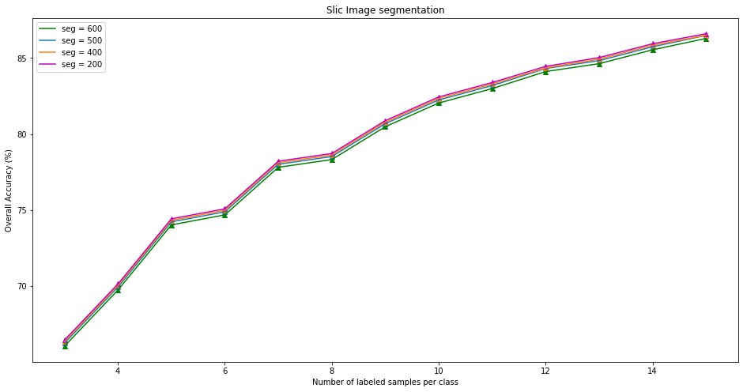

## Results and Discussion

This section represents the results obtained by employing two different superpixel segmentation mechanism one being the original work and other being the modified work.

##### 1.) Different Sample Pixels for training dataset

The classic Indian Pine hyperspectral image dataset is used for conducting the experiment. The ground truth data set has 16 classes. Since testing and training is performed on the same data set. A fixed number of labeled samples per class are randomly picked out from the labeled set to constitute the training set, while the rest of the labeled samples are used for testing. In our case, for training different number of sample pixels have been selected at random in range from 3-12 with a step size of 1 from each of the classes and rest of the pixels are selected for testing and classifying. Moreover, overall accuracy (OA) is adopted to evaluate the classification results, in which OA reflects the whole classification accuracy.

##### 2.) Parameter Analysis of the Number of Superpixels

In both Entropy rate superpixel and SLIC image segmentation mechanism, the number of superpixels can greatly influence the quality of generating superpixels. To analyse the effect of number of superpixels in the overall accuracy of the classification, different superpixel images are generated with varying number of segements ranging from 100 to 500 with a step size of 100. The experimental results showed that the classification performance is insensitive and robust to the variation in the number of superpixel. Although, on increasing the number of superpixels the overall accuracy decreases by negligible margin as it is visible in graph for both SLIC and Entropy rate superpixel image segmentation respectively.

##### 3.) Comparison between SLIC and ERS image segmentation schemes

The original work uses Entropy rate superpixel segmentation for generating superpixel image from the image obtained after PCA analysis. In our modified work we follow the exact same steps for Indian pines hyperspectral image dataset classification but for the difference that SLIC superpixel segmentation technique is used image segmentation. When different number of sample pixels have been used for training the dataset it has been observed that for both SLIC and ERS as number of sample pixels increases the classification accuracy increases.

When the graph is plotted between the number of labelled sample per class with the Overall accuracy OA with n on the x-axis and OA on the y-axis it has been observed that the Entropy rate superpixel (ERS) outperforms SLIC on an average with increase in 4.5% accuracy. This clearly suggests that the state of the art method ERS performs quite better than the general image segmenting algorithm SLIC.