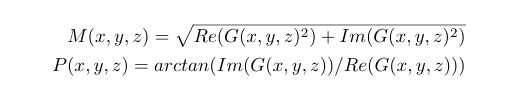
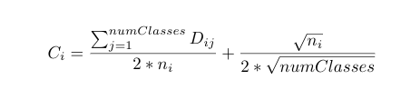

## Confidence Cube Computation

After generating the magnitude features described in equation, we use these features to generate a 3D matrix called the confidence cube with the dimension X x Y x C where X x Y is the image dimensions and C is the number of classes, which in our case is 16 for the indian pines dataset. This confidence cube gives us the confidence score for each pixel for each class. The higher the confidence score of a class for a given pixel indicates higher probability of the pixel to belong to that class. 

Confidence cube is computed by using a support vector classifier (SVC) which is trained on the training dataset pixels described before. The SVC uses the Radial Basic Function(rbf) kernel with the one-vs-one classification decision function for multi-class classification. This gives helps in deriving the confidence score for a pixel for each pair of class - ($C_1$, $C_2$). For each classifier corresponding to any two classes ($C_1$, $C_2$), a decision value d for the certain pixel is obtained by a voting process. The decision value d can be considered as the distance from the pixel to the optimal hyperplane \cite{Confidence_Cube}. Using this decision value d a decision matrix D is constructed for each pixel. This decision matrix has a dimension of CxC where C is number of classes(16 in our case). The entries of the decision matrix contain for each pair of classes ($C_1$, $C_2$), value = abs(d), where d is the decision value described above. Other entries are set to zero. After the decision matrix is built, we can construct the confidence cube using the following formula:

