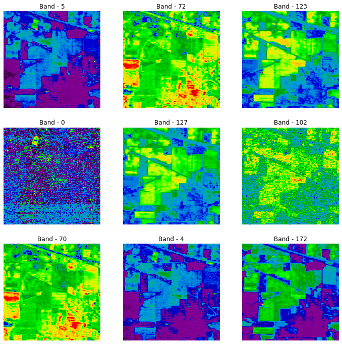
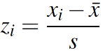
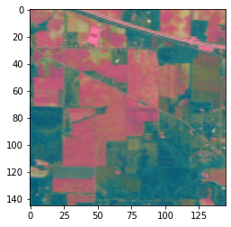

## Introduction

Hyperspectral Images (HSI) are formed by imaging the same spatial region using multiple wavelengths of light capturing hundreds of spectral bands. These wavelengths range beyond the visible region (400 - 800 nm), which human eyes cannot perceive and range in between 400 - 1100 nm. Thus a hyperspectral image has several bands often hundreds unlike typical color images that have 3 bands like RGB(Red, Green, Blue). Thus hyperspectral images carry muchmore information about the surface, materials that are present in a region. Such images are used extensively in imaging agricultural regions using satellite imagery.

## Data loading and Preprocessing

Indian Pine Hyperspectral Image dataset has been used to train and test the model. The process of acquiring the Indian Pine dataset and preprocessing steps to make it fit for further processing and evaluation has been described below:

The Data Preprocessing has 4 major steps:

#### 1.) Data Loading:

Indian pine hyperspectral image dataset has been been acquired in a ```.mat``` format. There are two datasets, one contains the ground truth or the classified image, while the other contains the corrected unclassified image dataset. The dataset has been loaded into python using ```scipy.io``` python module and has been converted into ```numpy``` array for further processing.



#### 2.) Data Scaling:

The dataset is of size ```145x145x200``` where 145x145 is the size of the image and there are 200 bands in the hyperspectral image. Since each pixel in the 145x145 image consits of 200 positive bands. For further analysis and processing the image is further normalized and scaled to occupy negative values using:



where ```s``` and ```x'``` are the standard deviation and mean of 200 values of the given pixel.


#### 3.) Train & Test Splitting:

Since, testing and training are performed on the same hyperspectral image, the dataset needs to be smartly classified into the train and test dataset. There are 16 classes in the ground truth image spanning across the 145x145 image pixels. For training 15 sample pixels have been selected at random from each of the classes and rest of the pixels selected for testing and classifying.

#### 4.) Principal Component Analysis:

Principal Component Analysis (PCA) is a dimensionality reduction mechanism, used for transforming a large data set of variables into a smaller one that still contains most of the information in the large set. Inorder to perform Entropy rate Superpixel regularization to create image segmentation, the 200 bands in the data sets needs to be reduced to 3 bands. The dataset is transformed to fit 3 bands which roughly represents the RGB representation of the dataset.


