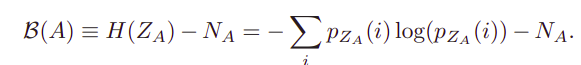
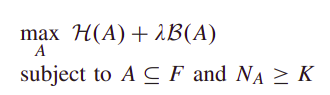

## Introduction

A superpixel can be defined as a group of pixels that share common characteristics (like pixel intensity ). Superpixels are becoming useful in many Computer Vision and Image processing algorithms like Image Segmentation, Semantic labeling, Object detection and tracking etc because of the following:

- They carry more information than pixels.
- Superpixels have a perceptual meaning since pixels belonging to a given superpixel share similar visual properties.
- They provide a convenient and compact representation of images that can be very useful for computationally demanding problems.

## Entropy Rate Superpixel(ERS) segmentation

ERS is a graph-based clustering method, which has demonstrated excellent superpixel extraction performance in the field of computer vision. ERS can extract useful spatial structure information of surface materials in a hyperspectral image. In order to acquire homogeneous superpixels with controllable sizes, ERS segmentation is used in this paper.

The Entropy rate superpixel segmentation method has 4 major steps:

##### 1.) Graph Construction:

Let V represent the set of vertices vi (i.e., the pixels) and F denote the set of edges e(i,j) , then a graph G = (V, F) is constructed by using eight-connected grid graph structure. The edge weight is defined by an exponential weight function which is a function of pixel intensity difference between i and j. Our goal is to select a subset of edges A ⊆ E such that the resulting graph, G = (V,A), contains exactly K connected subgraphs.

##### 2.) Entropy Rate of Random Walk:

In mathematics, a random walk is a mathematical object, known as a stochastic or random process, that describes a path that consists of a succession of random steps on some mathematical space such as the integers.

An elementary example of a random walk is the random walk on the integer number line , which starts at 0 and at each step moves +1 or −1 with equal probability. Other examples include the path traced by a molecule as it travels in a liquid or a gas (see Brownian motion), the search path of a foraging animal, the price of a fluctuating stock and the financial status of a gambler: all can be approximated by random walk models, even though they may not be truly random in reality.

The entropy rate quantifies the uncertainty of a stochastic process X. ERS uses the entropy rate of the random walk on the constructed graph as a criterion to obtain compact and homogeneous clusters. The entropy rate is a monotonically increasing function since the inclusion of any edges increases the uncertainty of a jump of the random walk. However, the increase can be large when the edges are selected to form the compact and homogeneous clusters.

##### 3.) Balancing Function

A balancing function is utilized to encourage clusters with similar sizes.  Let A be the selected edge set,
NA is the number of connected components in the graph,
and ZA be the distribution of the cluster membership. The balancing function is defined as:

The entropy H(ZA) favors clusters with similar sizes;
whereas NA favors fewer number of clusters. Similar to the entropy rate, the balancing function is also a monotonically increasing.

##### 4.) Optimization function:

Finally using the above components, an optimization function is formulated using the Entropy rate function and the Balancing function. The objective function combines the entropy rate and the balancing function, thus favoring the compact, homogenous, and balanced clusters. Clustering is achieved by optimizing the objective function on the edge set as:

where λ ≥ 0 is the weight of the balancing term and it can automatically adjust based on: 1) the number of superpixels K and 2) a data-dependent dynamic parameter β that is computed from the input image.

#### Current work
For this current work, ERS Superpixel segmentation can be used on the hyperspectral image after carrying out Principal component Analysis(PCA) on the spectral bands of the image and picking the top 3 bands and converting them to grayscale for processing.
