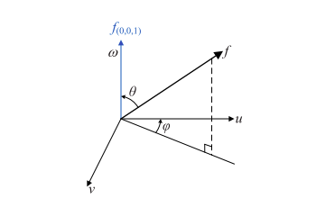
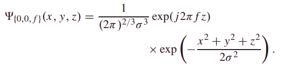

## Introduction

In the realms of image processing and computer vision, Gabor filters are generally used in texture analysis, edge detection, feature extraction, disparity estimation (in stereo vision), etc. Gabor filters are special classes of bandpass filters, i.e., they allow a certain ‘band’ of frequencies and reject the others.

Gabor Filters can be 2D or 3D, but the more common ones are 2D. We apply Gabor filter on an image just like any other filter, in form of a mask(or a convolutional kernel). In this section, let us first examine a 2D Gabor Filter, followed by 3D Gabor Filters
 
## 2D Gabor Filter
- To start with, Gabor filters are applied to images pretty much the same way as are conventional filters. We have a mask (a more precise (cooler) term for it would be ‘convolution kernel’) that represents the filter. By a mask, we mean to say that we have an array (usually a 2D array since 2D images are involved) of pixels in which each pixel is assigned a value (call it a ‘weight’). This array is slid over every pixel of the image and a convolution operation is performed

- When a Gabor filter is applied to an image, it gives the highest response at edges and at points where texture changes.

- A Gabor filter responds to edges and texture changes. When we say that a filter responds to a particular feature, we mean that the filter has a distinguishing value at the spatial location of that feature (when we’re dealing with applying convolution kernels in spatial domain, that is. The same holds for other domains, such as frequency domains, as well)

- There are certain parameters that affect the output of a Gabor filter. In OpenCV Python, following is the structure of the function that is used to create a Gabor kernel: ``` cv2.getGaborKernel(ksize, sigma, theta, lambda, gamma, psi, ktype) ```

- Here’s a brief introduction to each of these parameters.

    - ksize is the size of the Gabor kernel. If ksize = (a, b), we then have a Gabor kernel of size a x b pixels. As with many other convolution kernels, ksize is preferably odd and the kernel is a square (just for the sake of uniformity).

    - sigma is the standard deviation of the Gaussian function used in the Gabor filter.

    - theta is the orientation of the normal to the parallel stripes of the Gabor function.

    - lambda is the wavelength of the sinusoidal factor.

    - gamma is the spatial aspect ratio.

    - psi is the phase offset.

    - ktype indicates the type and range of values that each pixel in the Gabor kernel can hold.

## 3D Gabor Filter
Just like the 2D Gabor filter, 3D gabor filter is an extension of the 2D filter into 3 dimensions.  Concretely, for a 3-D Gabor filter in the 3-D frequency domain (u, v, w), three parameters should be clearly defined, including the central frequency(denoted as f) and two orientation parameters (denoted as θ and ϕ)

A 3-D Gabor filter can be formulated as:


We can visualize the central frequency in 3D as:


Here we can see that u and v axis represent the spatial directions and w axis represents the spectral direction. Since the internal structure of the hyperspectral image is unknown, it is necessary to apply Gabor filters with different scales and orientations on hyperspectral image to obtain sufficient features for classification. Generally, the orientation parameters θ and ϕ vary in the steps of 45◦, resulting in 13 Gabor filters with different directions for each scale in the 3-D domains, and considerable redundancy exists in the obtained large number of 3-D Gabor features. Recent advance in the literature has revealed that the Gabor features extracted by the Gabor filter parallel to the spectral direction, that is, orientation θ = 0 (the direction of the blue line in figure above), contain more discriminative information than the ones with other orientations, since the chosen Gabor filter is in accord with the spectral–spatial structure of hyperspectral image. 

The current paper, takes θ = 0, giving the following final equation for 3D Gabor filter:



In this paper, four different scales have been considered, i.e., f takes the values of [0.5, 0.25, 0 125, 0.0625 , and the corresponding four 3-D Gabor filters are obtained.

Each of the 4 Gabor filters is convolved with the hyperspectral image and since the filter is complex in nature, we get 2 parts of the operation:
- Magnitude features (Real Part)
- Phase features (Imaginary Part)

These are used in the next steps of the model.