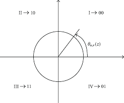
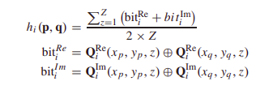

## Introduction

Convolution of raw hyperspectral image dataset with the 3D Gabor filter generates Gabor magnitude and phase features. The magnitude feature reflects the intensity values of the image whereas phase features provides information about the variation in orientation of the HSI dataset. Since, both magnitude and phase gabor features aids in classifying the HSI dataset it is desirable to consider the two kinds of features in a unified framework for hyperspectral image analysis. The gabor phase features which are sensitive to the changing positions have been properly encoded and employed for hyperspectral image classification.

## Hamming Cube Calculation

The Hamming Cube Calculation from the Gabor phase features has 2 major steps:

#### 1.) Quadrant Bit Encoding (QBC):

Quadrant bit encoding (QBC) which is a typical phase-quadrant demodulation coding method is applied on the Gabor phase feature set. QBC is a coding scheme which encodes phase features based on quadrant information it belongs to. Concretely, for each band z in each pixel (x,y) denoted as ```P(x,y,z)``` Gabor phase feature cube is encoded into two bits, ```(QRe(x,y,z), QIm(x,y,z))```.



To be precise ```P(x,y,z)``` has two components Real and Imaginary, the real component is represented by ```cosine``` and imaginary component with ```sine``` value. Hence, Real component is set to ```1``` if ```cosine > 0``` otherwise ```0```. Similarly, Imaginary component is set to ```1``` if ```sine > 0``` otherwise ```0```.


#### 2.) Hamming Distance Matching:

Once the gabor phase values has been encoded using quadrant bit encoding. The hamming distance metric is applied to measure the similarity between the sample pixels. Concretely, the hamming distance between the pixels p and q in the QBC feature cube is computed as:



The hamming distance for any two pixels is between 0 and 1 and smaller the value more similar are the two pixels. In our case, pixel-to-class hamming distance is calculated. To be precise, for each pixel in the classified training dataset hamming distance is calculated with each pixel in the test dataset. For pixels in a given class the one which has the minimum hamming distance with the test dataset, is assigned as the hamming distance to that pixel class. The hamming distance between the pixel p and the cth class is computed as:


Hence, after hamming cube computation the size of the image gets reduced from `145*145*B` to `145*145*C` where `C` are number of classes. As each pixel now has C bands where each band in C has minimum hamming distance for that class. The lower the hamming distance for a class higher will be chances of belonging to that class.