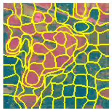
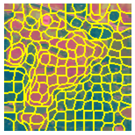

## Weighing Cube Computation

For each of the 4 frequency values used for generating the Gabor Filter, we will get 4 gabor filters, which in turn will generate 4 magnitude and phase feature vectors, which in turn generates 4 Confidence cubes and 4 hamming distance cubes. We will combine these cubes into a single weighing cube that will be used in cascading with the superpixel graph and regularization process.

## Cascade Super Pixel

The weighing cube in itself can be used to determine the classes by picking the maximal value for each pixel from the array of values for the classes. This can generate good results, but this does not capture the spatial information that we could have obtained, which is why the superpixel graph is used and the weighing cube is regularized using the superpixel graph. The regularization will be carried out in each superpixel one by one. If a superpixel contains only one training sample, it is reasonable to consider that all pixels in this superpixel belong to the label of the single training sample. Since each superpixel is homogenous as much as possible, the weight of this class will be set to 1 and others to 0 for every pixel in this superpixel. Otherwise, all these pixels’ weights of each class are replaced by the mean value of them. Through regularizing the weighting cube in this way, the spatial information of surface materials contained in superpixels can be integrated into the weighting cube. The number of superpixel segments is not easy to estimate, hence we create a series of superpixel graphs by varying the number of segments from over-segmentation to under-segmentation and sum together all the regularized weighing cube into a final cube.

